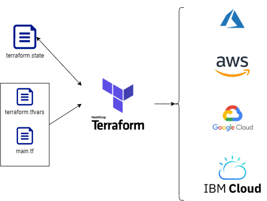

# IaC with Terraform



We'll build a script to connect to AWS and download/setup all dependencies
- keyword: `provider` allows us to connect to aws
- then we will run `terraform init`
- then we'll move on to launching aws services
- keyword: `resource` provide resource name
- resource aws_ec2_instance, name it as eng89_ron_terraform, ami, type of instance, with or without ip
- `terraform plan` to check syntax
- `terraform apply` to execute code

Create a `variable.tf` file
```
variable "AWS_KEY_NAME" 
	{ default = "eng89_ron_ter" }
variable "AWS_KEY_PATH" 
	{ default = "~/.ssh/eng89_ron_ter.pem" }
```
Edit `main.tf`
```
provider "aws" {
	
	region = "eu-west-1"
}

resource "aws_instance" "app_instance" {
	key_name = var.AWS_KEY_NAME
	ami = "ami-038d7b856fe7557b3"
	instance_type = "t2.micro"
	associate_public_ip_address = true
	tags = {
		 Name = "eng89_ron_terraform"
	}
}
```

To create public/private keys in Git Bash
- Head over to your .ssh folder and create .pub and .pem keys
- `ssh-keygen -t rsa -b 2048 -v -f eng89_ron_ter`
- `mv eng89_ron_ter eng89_ron_ter.pem` to add the .pem extension
- `chmod 400 eng89_ron_ter.pem`
- `chmod 600 eng89_ron_ter.pub`

Import Public key to AWS
- Navigate to: EC2 >> Network & Security >> Key Pairs
- Actions >> Import key pair
- Name: `eng89_ron_ter`
- Browse and import the `eng89_ron_ter.pub` file
- Press `Import Key Pair` button

Now we can SSH into the newly created EC2 instance from our .ssh folder


More info on how to set-up Tables:
https://github.com/rurbonas/eng89_VPC_setup